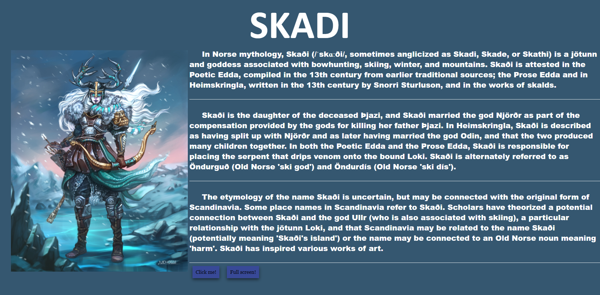
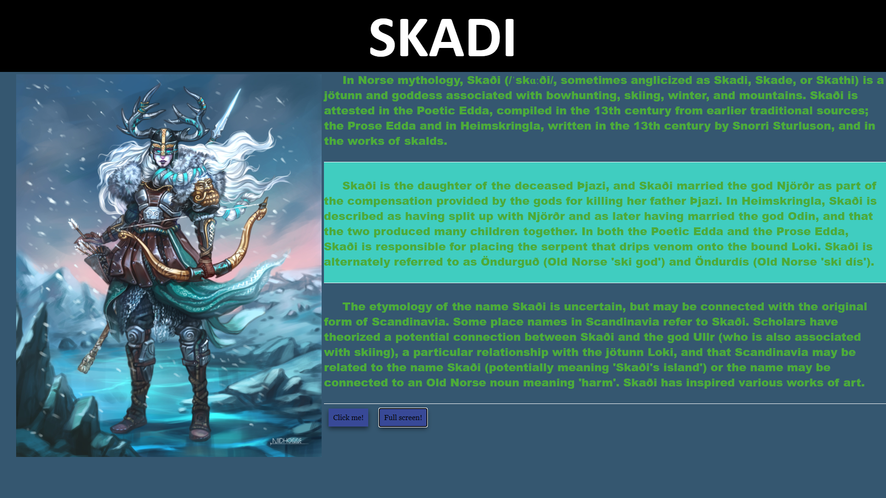
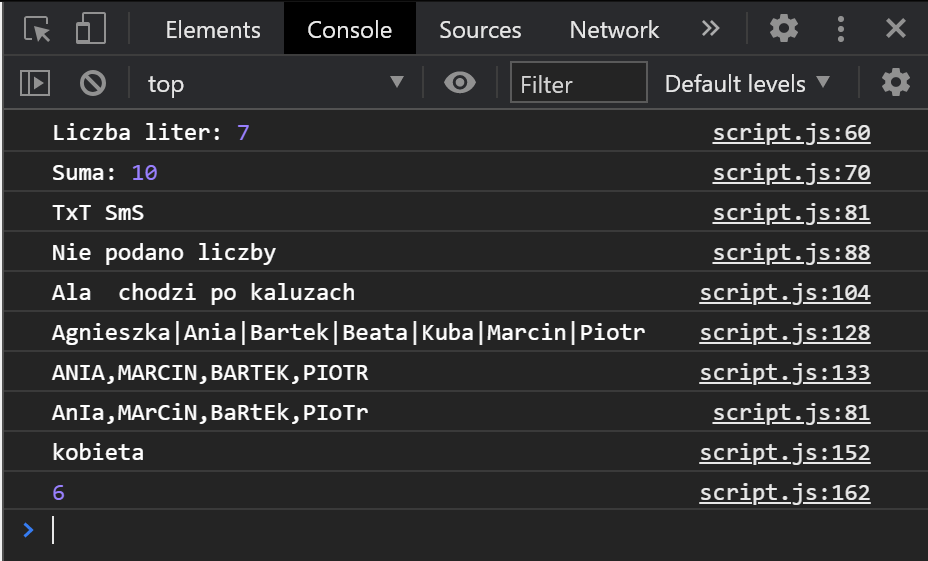

# BJamrowski-projektowanie-serwisow-www-21666-185ic
## Repozytorium przedmiotu Projektowanie stron WWW

Strona ta powstala jako zadanie do laboratorium nr 3.
Projekt zakladal stworzenie strony, ktora obsluguje 10 wybranych zdarzen. Te zdarzenia to:
```
1.przycisk zmienajacy kolor tla tytulu
2.komunikat pojawiajacy sie po skopiowaniu tytulu
3.zmiana czcionki tekstu po najachaniu na niego myszka
4.powtorna zmiana coloru tekstu po opuszczeniu myszka jego obszaru
5.zmiana koloru tla akapitu po najechaniu kursorem na jego obszar
6.komunikat po kliknieciu prawym przyciskiem myszy na obraz
7.powiekszenie obrazu po podwojnym kliknieciu na niego
8.zmiana koloru tla akapitu po rzejsciu w tryb pelnowymiarowy
9.zmiana koloru tla tytulu gdy klawisz jest wcisniety
10.zmiana koloru tla tytulu gdy puscimy klawisz
```

Poczatkowy wyglad strony:


Zmodyfikowana strona:


Wyniki kolejnych zadan z JS:

