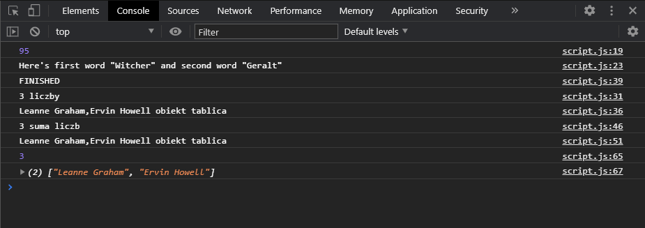
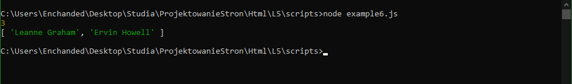

# BJamrowski-projektowanie-serwisow-www-21666-185ic
## Repozytorium przedmiotu Projektowanie stron WWW

Projekt ten zawiera zadania zrealizowane z zakresu asynchronicznego JS
dla laboratorium nr 5.

Aby podejrzec dzialania zadan nalezy uzyc konsoli.
Wynik zadania nr 6 nie jest widoczny w przegladarce ze 
wzgledu na wykorzystanie funckji request(), ktora 
nie jest wspierana przez przegladarki.

Opisy funkcji:
```
Zad1
withCallNum wykonuje 	dzialanie na 2 liczbach 
withCallWord 		laczy 2 lanuchy znakowe

Zad2
getDataFetch 		wypisuje sume 2 liczb oraz tablice skladajaca sie z 2 ciagow znakow

Zad3
example3		jak w zad2, wykorzystuje async oraz await

Zad4
example4		jak w zad2, wykorzystuje AJAX

Zad6
plik example6.js	jak w zad2, wykorzystuje axios
``` 

Ponizej widzimy efekt do pierwszych 4 zadan.


Tutaj widzimy efekt ostatniego, szostego zadania.

