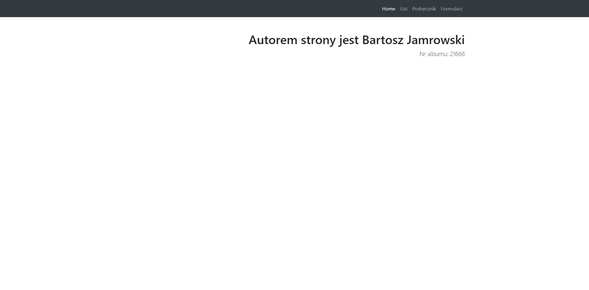

# BJamrowski-projektowanie-serwisow-www-21666-185ic
Repozytorium przedmiotu Projektowanie stron WWW

Strona jest projektem na laoratorium nr 1. Projwekt sklada sie z 1 strony glownej
oraz 3 podstron. Podstrony zostaly zrealizowane zgodnie z poszczegolnymi zalozeniami.

Na glownej stronie zajduje sie tworca strony wraz z indeksem.

Na podstronie *List* znajduje sie tekst sformatowany w stylu klasycznego listu.

Kolejna zostala sformatowana w stylu podrecznika.

Na ostatniej podstronie umieszczony zostal prosty formularz.

