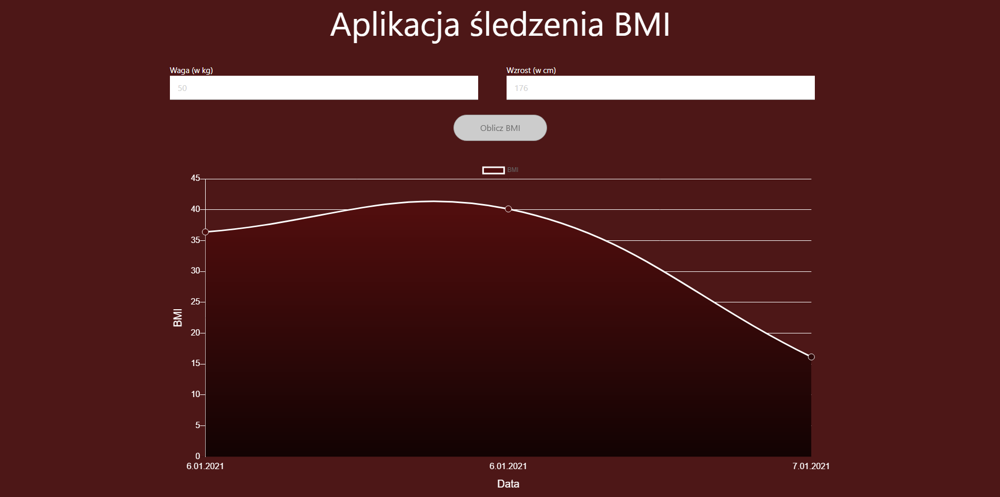
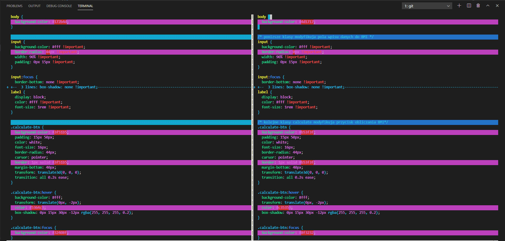

# BJamrowski-projektowanie-serwisow-www-21666-185ic
## Repozytorium przedmiotu Projektowanie stron WWW

Projekt ten polega na modyfikacji wybranej modyfikacji. 
Aplikacja, ktora wybralem do tego zadania to kalkulator BMI, ktory
pozwala na sledzenie zmiany BMI. Diagram pokazuje jak nasz wskaznik zmienia sie
wraz z kolejnymi wpisami.
Zmiany, ktore wprowadzilem w tym projekcie to zmiany szaty graficznej.
Ponizej zaprezentowana jest zmodyfikowana aplikacja.

Kolejnym elemntem laboratorium bylo zapoznianie sie z poleceniem
git difftool. Jest to bardzo przydatne narzedzie podczas pracy z repozytorium.
Dzieki niemu mozemy sprawdzic roznice miedzy 2 plikami. Mozemy rowniez
porownywac ten sam plik w porownaniu z nim samym w poprzednich commitach.

Efekt wykorzystania polecenia git difftool

Link do oryginalnego projektu:
https://github.com/ahfarmer/calculator
