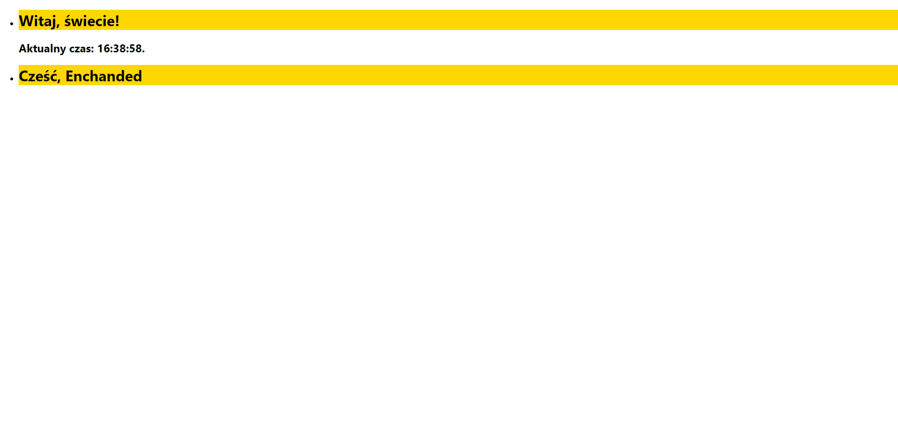

# BJamrowski-projektowanie-serwisow-www-21666-185ic
## Repozytorium przedmiotu Projektowanie stron WWW

Projekt ten zawiera zadania zrealizowane z Reactem do lab nr 6.

React to bardzo przydatne narzedzie. Wykorzystuje on JSX co pozwala na wykorzystywanie
znacznikow HTML wewnatrz skryptow JS. React wykorzystuje komponenty klasowe oraz
funckyjne. Sa one do sibie podobne, jednak pierwszy to klasa natomiast drugi to
funkcja. Funkcje przyjmuja jako argument props, czyli wlasciwosci, ktorymi moga byc atrybuty
jak i metody.
Ponizej przedstawione sa komponenty klasowe oraz funkcyjne zastosowane w projekcie.
```
class Clock extends React.Component {
  constructor(props) {
    super(props);
    this.state = {date: new Date()};
  }

  componentDidMount() {
    this.timerID = setInterval(
      () => this.tick(),
      1000
    );
  }

  componentWillUnmount() {
    clearInterval(this.timerID);
  }

  tick() {
    this.setState({
      date: new Date()
    });
  }

  render() {
    return (
      <div>
        <h1>Witaj, świecie!</h1>
        <h2>Aktualny czas: {this.state.date.toLocaleTimeString()}.</h2>
      </div>
    );
  }
}

function Welcome(props) {
  return <h1>Cześć, {props.name}</h1>;
}
```
Komponenty funkcyjne moga wykorzystywac stan. Jest on podobny do props
z tym, ze jest prywatny i w pelni kontrolowany przez komponent.
Wykorzystanie stanu w laboratorium.
```
class Clock extends React.Component {
  constructor(props) {
    super(props);
    this.state = {date: new Date()};
  }

  componentDidMount() {
    this.timerID = setInterval(
      () => this.tick(),
      1000
    );
  }

  componentWillUnmount() {
    clearInterval(this.timerID);
  }

  tick() {
    this.setState({
      date: new Date()
    });
  }

  render() {
    return (
      <div>
        <h1>Witaj, świecie!</h1>
        <h2>Aktualny czas: {this.state.date.toLocaleTimeString()}.</h2>
      </div>
    );
  }
}
```

Podczas laboratorium wykorzystala funckja map(). Pozwala ona wykonanie dzialan
na tablicy. Wewnatrz niej mozna uzyc klucza co pozwoli nam jednoznacznie 
odroznic wykorzystane elementy.
Zastosowanie funckji map do generowania elementow.
```
function App() {
  const elements = [<div><Clock/></div>,<div><Welcome name="Enchanded" /></div>];
  return (
    <ul>
      {elements.map(item => <li key = {item.id}>{item}</li>)}
    </ul>
  );
}
```


Efekt koncowy.

