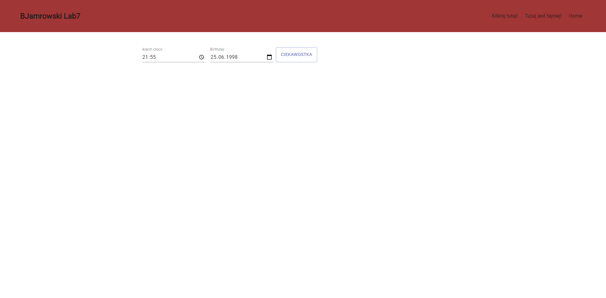
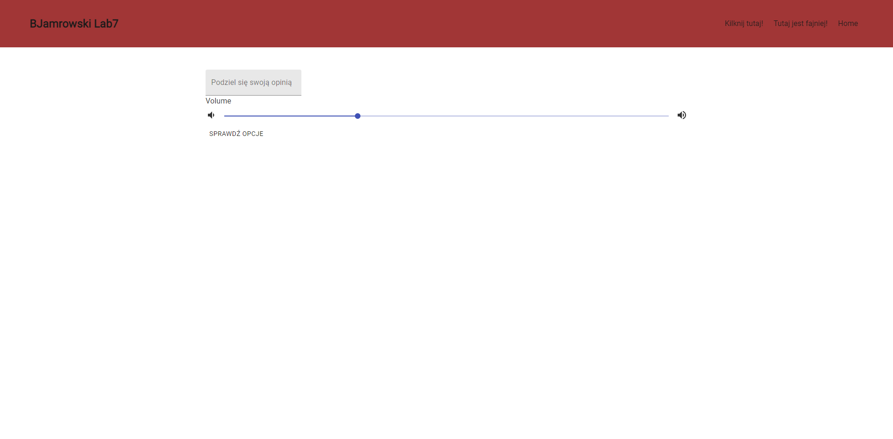
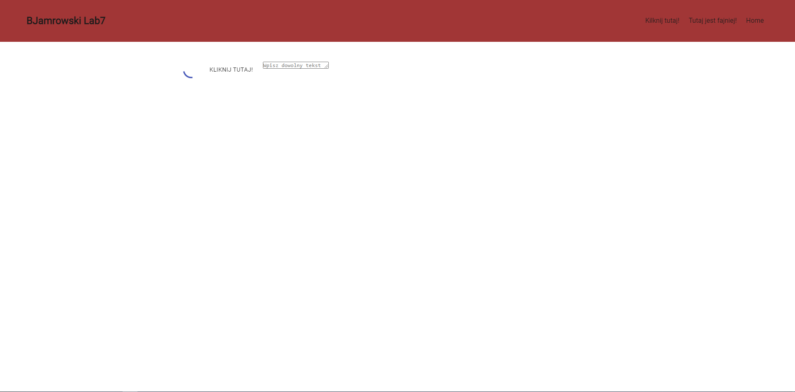

# BJamrowski-projektowanie-serwisow-www-21666-185ic
## Repozytorium przedmiotu Projektowanie stron WWW

Projekt ten zawiera zadania zrealizowane z Reactem do lab nr 7.

Celem laboratorium było stworzenie psrostej SPA, czyli Single Page Application. Polega ona na tym,
ze podczas kontaktu z uzytkownikiem strona nie musi sie za kazdym razem przeladowywac. Przy pierwszym
uruchomieniu serwer wysyla glowne dane niezbedne przy kazdej podstrony. Przy kazdym rzadaniu przez uzytkownika
przesylane sa tylko dane do tego rzadania. Pozwala to na przyspieszenie obslugi stron.
Do stworzenia SPA wykorzystuje sie Routery. Sa one adresami do kolejnych podstron. Aby moc je preszukiwac nalezy
zastosowac Switch. Ich zadaniem jest przeszukiwanie Routerow w celu znalezienia pasujacego. W celu wspolpracy
z Router wykorzystane sa Link. Podobne sa one do znacznika a.

Ponizej zaprezentowano wyglad 3 zadanych podstron.

